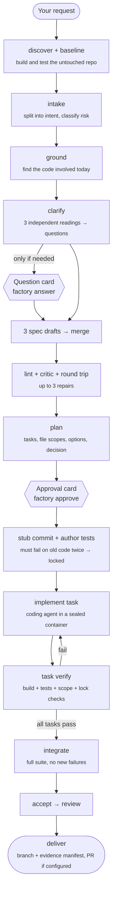

# AI Factory

> Turn a plain-English change request into a **verified pull request** on a real .NET + Postgres codebase, with every step checked by code, not by the AI's word.


AI Factory is a command-line tool. You type what you want changed. It asks you only the questions that matter, writes a spec, plans the work, and asks you to approve. Then it writes the tests first, implements the change, runs every check itself in sealed containers, and hands you a branch (or a PR) with the evidence attached.

```bash
factory start "Return 404 instead of 500 when an order ID doesn't exist" --project shop-api
```

---

## Contents

- [Why](#why)
- [How it works](#how-it-works)
- [What's built / what isn't](#whats-built--whats-not)
- [Requirements](#requirements)
- [Installation](#installation) · [Why Ubuntu on Windows?](#why-ubuntu-wsl-on-windows)
- [Add a project](#add-a-project)
- [Your first run](#your-first-run)
- [Use it on your own .NET repo](#use-it-on-your-own-net-repo)
- [Web screens](#web-screens)
- [Command reference](#command-reference)
- [Use it from Claude Code](#use-it-from-claude-code)
- [Safety model](#safety-model)
- [Troubleshooting](#troubleshooting)
- [Project layout](#project-layout)
- [Development](#development)
- [Design docs](#design-docs)

---

## Why

Coding agents are good at writing code and bad at proving it's right. They can say "all tests pass" when they didn't run, skip a failing test, or quietly change the test instead of the code. AI Factory puts the agent inside a pipeline where:

- **Plain code decides, not a model.** Every step ends at a gate (a small, deterministic check). The same inputs always give the same decision.
- **The factory runs the checks itself.** Build and tests run in throwaway containers the AI can't touch; the factory reads the results.
- **Tests come first and get locked.** Acceptance tests are written from the spec, must fail on today's code, and are then locked by fingerprint. The implementer can't edit them.
- **Humans decide on a terminal.** Approvals are tied to the exact plan you saw. Change the plan and the approval no longer counts.
- **Everything is recorded.** Each run keeps an append-only ledger, and `factory verify-evidence` re-checks every decision later.

---

## How it works



**The steps in plain words**

| Step | What happens | Who does it |
|---|---|---|
| discover | Builds and tests the untouched repo once and remembers the result, so the run is only blamed for *new* failures. Refuses repos it can't handle yet. | Factory (no AI) |
| intake | Splits your request into short "intent" quotes, classifies it (bugfix/feature…) and its risk. | AI (Haiku) |
| ground | Finds the files and methods involved today, quoting them. Quotes are checked against the real files. | AI (Opus) |
| clarify | Three AIs read your request independently. Where they **disagree**, that's ambiguity. You get at most 5 questions (then at most 3 more); everything else becomes a written assumption. | AI + you |
| specify | Three independent spec drafts (EARS requirements + Given/When/Then tests) are merged. Code checks the format; a critic looks for gaps; a round-trip check restates the spec and compares it to your words. | AI + code |
| plan | Tasks with exact file scopes, at least two options and a short decision record. | AI (Opus) |
| **approval** | One card with your request word for word, the answers, the requirements, every file the plan will touch and the critic's findings. | **You** |
| author tests | A coding agent writes one test per acceptance criterion. The factory runs them on the old code **twice**; they must fail for the right reason. Then they're locked. | AI + factory |
| implement ⟲ verify | A coding agent works on one task at a time in a sealed container. The factory then builds, runs the tests, and checks the change stayed in scope, didn't touch locked tests, added no skips or secrets. Each task must also keep earlier tasks' tests passing. Failures loop back with the exact errors; if only tests or the build failed, the retry fixes the existing change instead of starting over. | AI + factory |
| integrate / accept | Full test suite; every locked test must have run and passed; no new failures vs the baseline. | Factory |
| review | A reviewer (a different model family when an OpenAI key is set) reads the diff, with an OWASP Top 10 checklist for security. Whether a finding blocks is decided by code. | AI + code |
| deliver | Secret scan of every commit, an evidence manifest commit, and a PR (or a local branch). | Factory |

When something keeps failing, the factory climbs a fixed ladder (retry with the errors → more effort → stronger model) and then **parks** the run for you. Hard limits on attempts, spend and time stop runaway runs; `factory status <run>` shows the running cost.

---

## What's built / what's not

| Built | Not yet |
|---|---|
| Brownfield mode on **.NET + Postgres** repos | Greenfield and estimate modes |
| Clarify, 3-draft spec, merge, lint, critic, round trip | Accept that boots the app and records HTTP/DB evidence (today: "the locked test passed") |
| Plan + approval card, stub commit, locked tests | Applying `steer` changes mid-run (recorded, not applied) |
| Claude coding agent in a sealed container | Codex and jcode runners; Next.js/Node repos |
| Test lab: restore → offline build → tests next to a throwaway Postgres | Review repair loop (blocking findings park the run); unlock card for a wrong test |
| Ledger, crash-resume, failure ladder, cost caps, verify-evidence | URL-prefix package filter (today: allowlist by host name) |
| GitHub PR delivery (optional) | Bitbucket PR delivery (today: branch ready locally) |
| Design toolkit for web apps (no AI): how big a UI change is, shown on the approval card; style checks; `factory design` | The design mock step and screenshots; the design checks aren't called by any step yet |

**Refused for now:** SQL Server, repos whose tests start their own containers (Testcontainers), Windows-only projects (WPF/WinForms/.NET Framework), Git LFS, submodules.

---

## Requirements

| | |
|---|---|
| **Computer** | macOS (Apple Silicon or Intel), Windows 10/11, or Ubuntu |
| **Disk** | ~15 GB free (container images and package caches) |
| **API key** | An Anthropic API key with credit (required). An OpenAI key is optional. A Claude Pro/Max subscription is **not** an API key: create one at [console.anthropic.com](https://console.anthropic.com) → API Keys. |
| **Access** | Read access to this GitHub repo |

Everything else (Node, containers, the `factory` command, images, the Claude Code connection) is installed by the setup script.

---

## Installation

One command per system. It's safe to run again: it skips whatever is already done and only asks for your password when it installs something. At the end it asks for your API key (typing is hidden) and runs `factory doctor`.

### macOS

Open **Terminal** and run:

```bash
git clone https://github.com/im-ahsan/ai-factory.git ~/ai-factory && bash ~/ai-factory/scripts/setup.sh
```

> If a window asks to install Apple's command line tools, click **Install**, then run the same command again.

It installs Homebrew, Node 22, and **Colima** (a free, lightweight way to run the containers; Docker Desktop isn't needed).

### Windows

Open **PowerShell as administrator** (right-click → *Run as administrator*) and run:

```powershell
git clone https://github.com/im-ahsan/ai-factory.git $env:TEMP\ai-factory; powershell -ExecutionPolicy Bypass -File $env:TEMP\ai-factory\install.ps1
```

> Add `-NoKeys` to skip the API-key question and add keys later. No git on Windows? Download [`install.ps1`](install.ps1) from GitHub and run `powershell -ExecutionPolicy Bypass -File install.ps1` from your Downloads folder.

The first time, it installs WSL + Ubuntu and asks you to create a Linux username and password (and may ask for a restart). **Run the same command again afterwards**; it then installs everything inside Ubuntu and connects VS Code. From then on, open the factory with:

```powershell
wsl -d Ubuntu -- code ~/ai-factory
```

The VS Code terminal is already Ubuntu; run all `factory` commands there.

#### Why Ubuntu (WSL) on Windows?

- **Sealed rooms.** The factory runs code nobody has reviewed yet: the AI's code and the repo's own build and test scripts. It runs them in throwaway containers with no internet and no access to your files, so they can't read your keys, touch your machine or fake test results. That's what makes a "pass" trustworthy.
- **They're Linux containers.** The official .NET SDK and Postgres images and the coding agent are Linux-based, and the network lockdown is a Linux container feature. Macs run the same containers, so everyone gets one design.
- **Windows always needs a Linux VM for them.** The only other option is Docker Desktop, which needs a paid licence at our company size and runs the same hidden Linux VM (WSL) underneath. Using Ubuntu directly is free and faster.
- **Day to day you barely see it.** The installer sets it up. Open the project with `wsl -d Ubuntu -- code ~/ai-factory`; VS Code's terminal is already Ubuntu. Run git there, not from Windows.
- **Why not skip containers?** Then the AI and the repo's code would run with your permissions, with access to your keys, network and local databases, and test results could be faked. Not acceptable for client code.

### Ubuntu / Linux

```bash
git clone https://github.com/im-ahsan/ai-factory.git ~/ai-factory && bash ~/ai-factory/scripts/setup.sh
```

### After setup

Open a **new** terminal, then:

```bash
factory doctor
```

```
ok   Node v22.x
ok   container runtime: /usr/bin/docker
ok   ~/.factory/.env exists
ok   ANTHROPIC_API_KEY set in ~/.factory/.env
note OPENAI_API_KEY not set: critic and review will use Claude (single family)
```

Skipped the key during setup? Add it any time: `nano ~/.factory/.env` → `ANTHROPIC_API_KEY=sk-ant-...`. Never paste keys into chat, tickets or the repo.

To start runs from Jira tickets (`--jira`), add these three lines too (optional):

```ini
JIRA_BASE_URL=https://yourcompany.atlassian.net
JIRA_EMAIL=you@yourcompany.com
JIRA_API_TOKEN=...        # id.atlassian.com → Security → Create API token
```

<details>
<summary><b>What the setup does</b> (and how to do it by hand)</summary>

| Step | macOS | Windows / Ubuntu |
|---|---|---|
| Base | Apple command line tools, Homebrew | WSL + Ubuntu with systemd (Windows), git, curl |
| Node 22 | nvm | nvm |
| Containers | `brew install colima docker`, `colima start --cpu 4 --memory 8` | Docker Engine CE from Docker's apt repo, your user added to the `docker` group |
| Factory | `npm ci && npm run build && npm link` | same |
| Secrets | `~/.factory/.env` (mode 600) | same |
| Images | `node:22-alpine`, `postgres:16-alpine`, `mcr.microsoft.com/dotnet/sdk:8.0`, and `factory-agent:dotnet8` built from `docker/agent` | same |
| Claude Code | `claude mcp add -s user ai-factory -- node <repo>/dist/cli/index.js mcp` (only if Claude Code is installed) | same |
| Windows extras | – | Ubuntu's git uses your Windows GitHub sign-in; VS Code WSL extension |

Docker Desktop is never used (licensing). The factory refuses to run against it.

</details>

---

## Add a project

Point `factory init` at a .NET repo: a local folder (Windows paths like `/mnt/c/...` are fine) or a git URL.

```bash
factory init /mnt/c/Users/<you>/source/repos/shop-api     # Windows
factory init ~/code/shop-api                              # Mac / Linux
factory init https://github.com/<org>/shop-api.git        # or a URL
```

```
Project shop-api
  repo        /home/<you>/code/shop-api (branch main)
  solution    ShopApi.sln
  .NET        net8.0 → mcr.microsoft.com/dotnet/sdk:8.0
  database    Postgres; tests log in as "shop" to ShopTestDb (tests/Shop.Tests/DbFixture.cs)
  hidden      web (frontend folders the AI won't see)

Wrote ~/.factory/projects/shop-api.yaml
Next: factory baseline --project shop-api
```

What it does for you:
- **Copies the repo into Linux** when it's on a Windows drive or a URL (the factory never works on `C:`).
- **Detects** the solution, the .NET version (→ build image), Postgres, and a database login the tests hardcode. That password goes to `~/.factory/.env`, never into the config.
- **Hides** frontend folders from the AI and **warns** about anything the POC can't run yet.
- Writes `~/.factory/projects/<name>.yaml` (no secrets). Tweak it if you need to; see [`docs/project-example.yaml`](docs/project-example.yaml).

Then record the baseline (builds and tests the untouched repo; no AI, no cost):

```bash
factory baseline --project shop-api
```

```
done in 95s: 412 tests, 405 passed, 7 failed, 0 skipped; exit 1; valid=true
```

Tests that already fail are fine: they're remembered, and a run is only blamed for **new** failures. But code covered only by failing tests has no protection, so pick changes elsewhere.

<details>
<summary><b>Project config reference</b></summary>

| Field | Meaning |
|---|---|
| `repo`, `baseBranch` | The local clone and the branch runs start from. |
| `dotnet.sdkImage` / `solution` | Build image and the solution (or project) that restore, build and test use. Optional: when the repo root has no `.sln` or `.csproj`, the factory uses the shallowest solution below it, else the only project (e.g. `backend/Api/Api.csproj`). Set it when there are several. |
| `database.name` / `user` / `passwordEnv` | The test database, and the login your tests hardcode (created without superuser). The password lives in `~/.factory/.env`. |
| `producerEnv` | Environment for the **test** container only. `{{DB_*}}` are filled in by the factory. |
| `agentEnv` | Dummy environment for the **coding** container, so the app compiles. Never real secrets. |
| `noGo` | Globs hidden from every AI step. |
| `dotnet.runnerArgs` | Extra test-runner settings, e.g. `["xUnit.ParallelizeTestCollections=false"]`. |
| `forge` | GitHub repo to push to and open PRs (`{ kind: github, repo: owner/name, tokenEnv: GITHUB_TOKEN }`). Without it, delivery leaves a ready branch locally. |
| `steps` | Override the model per step (advanced; see `src/stages/routing.ts`). |

</details>

---

## Your first run

All `factory` commands run in the **Ubuntu terminal** on Windows (any terminal on Mac/Linux); see *Where to type these* below.

**Check the whole machine for free first:**

```bash
factory selftest     # one full run on a small sample repo, $0, about 5 minutes
```

It builds a tiny .NET shop with one bug, then runs the whole pipeline on it for real: test lab, test database, the coding container, every check, the approval card (approved automatically) and delivery to a local branch. Only the AI answers are scripted, so nothing is spent. It ends with one line per piece (`ok` or `FAIL`) and cleans up after itself. No API key needed.

**Then spend cents before dollars.** After adding your key, check every paid connection:

```bash
factory smoke        # one tiny call per model, the key proxy, the coding agent in its container: a few cents
```

It stops at the first failure (bad key, unknown model, proxy problem), so nothing bigger runs against a broken setup. Then start with a spend limit, and optionally fewer retries in the project config (`policy: { retryBudget: 2 }`):

```bash
factory start "Return 404 instead of 500 when an order ID doesn't exist" --project shop-api --max-cost 5
```

The factory works until it needs you, then prints what to do and exits. Nothing runs in the background while it waits. After each step it prints what that step cost and the running total. A bad key, an unknown model or a rejected request stops the run at once instead of retrying.

**1. Questions (only if needed)**

```bash
factory show-card <run>
factory answer <run> <hash> Q-1=A Q-2="only for guest checkouts"
```

Unanswered questions take the recommended option. Low-risk question cards default automatically after 24 hours.

**2. Approval**

```bash
factory show-card <run>        # read the card: request, answers, requirements, files, plan, findings
factory approve <run> <hash> --note "low risk, one controller"
# or
factory approve <run> <hash> --reject "don't change the payments module"   # the spec and plan are revised, you get a new card
```

`<run>` can be any unique part of the run ID; `<hash>` is the first characters of the card hash printed on the card.

**3. Result**

```bash
factory status <run>
factory show-card <run> --pr   # the PR description the factory wrote
git -C ~/code/<repo> log --oneline <base>..factory/<run>
factory verify-evidence <run>  # re-check every recorded decision
```

The branch `factory/<run>` holds the stub commit (if any), the locked tests, one commit per task and one evidence-manifest commit.

**If a run parks**, `factory status <run>` says why (cap hit, a check failed twice, a locked test keeps failing…). Fix the cause and run `factory resume <run>`, accept a higher limit with `factory waive-cap`, or start a new run.

---

## Use it on your own .NET repo

Six commands, once setup is done and your key is in `~/.factory/.env`.

> **Where to type these:** on Windows, in the **Ubuntu terminal** (Start menu → Ubuntu; the prompt looks like `you@machine:~$`), or in VS Code opened with `wsl -d Ubuntu -- code ~/ai-factory` (bottom-left says *WSL: Ubuntu*). On Mac or Linux, any terminal. PowerShell and CMD can't find `factory`. Windows paths are written the Linux way: `C:\Users\you\repos\x` → `/mnt/c/Users/you/repos/x`.

**1. Add the project** (free)

```bash
factory init /mnt/c/Users/<you>/source/repos/shop-api     # a repo on your Windows drive
factory init https://github.com/<org>/shop-api.git        # or a git URL (Bitbucket works too)
```

It copies the repo into Ubuntu (`~/code/shop-api`; your Windows copy is untouched), detects the solution, the .NET version, Postgres and any database login the tests use (that password goes into `~/.factory/.env`), hides frontend folders from the AI, writes `~/.factory/projects/shop-api.yaml`, and warns about anything it can't handle yet.

**2. Look over the config** (2 minutes): `code ~/.factory/projects/shop-api.yaml`

- `baseBranch`: the branch changes start from.
- `accept.env`: flags the app needs to start properly, e.g. one that makes it run its database migrations:
  ```yaml
  accept:
    env:
      RUN_MIGRATIONS: "true"
  ```
- Optional, for cheap trial runs: `policy: { retryBudget: 2 }`.

**3. Baseline** (free, a few minutes)

```bash
factory baseline --project shop-api
```

The build must be ok. Tests that already fail are fine: they're remembered, and a run is only blamed for new failures.

**4. Cheap check** (a few cents)

```bash
factory smoke --project shop-api
```

**5. Run a change**

```bash
factory start "what you want changed, in plain words" --project shop-api --max-cost 5
# or from a file, or from a Jira ticket:
factory start --file request.md --project shop-api --max-cost 5
factory start --jira SHOP-412 --project shop-api --max-cost 5
factory logs <run> --follow        # in a second terminal
```

Answer the question card if one appears, read the approval card, then approve.

**Estimating instead of building.** `factory estimate` takes requirements (a prompt, `--file` as Markdown, text or Word, `--frames` for exported Figma frames, or `--jira`) and produces an effort, API-cost and elapsed-time estimate of delivering them through the factory. A lead approves it on the terminal, then two workbooks (team and client) are written under the run's `export/` folder. See `docs/estimates-design.md`. The workbooks are drawn on Folio3's estimation template, which the repo ships with its text cleared (`src/estimate/assets/estimation-template.xlsx`), so nothing needs setting. To use a newer template file instead, set `estimateTemplate: /path/to/Example_Estimation.xlsx` in the project config (or `FACTORY_ESTIMATE_TEMPLATE` in the environment).

```bash
factory estimate --file requirements.docx --project shop-api --no-repo --delivery-model hitl --rate backend=55 --rate default=40
factory approve <run> <hash> --sign-off EST-4     # low-confidence lines need a sign-off
factory waive <run> <hash> --reason "why"         # only for E3, E4 and E5
factory edit-estimate <run> <hash> --anchor EST-1=6-12 --reason "why"   # recomputes, new card
factory estimate --from-run <run> --delivery-model agentic              # the other delivery model
factory estimate --revises <run> --file changed.md --project shop-api   # a change request (v2)
factory start --from-estimate <run> --project shop-api                  # build it, held to the estimate
```

**6. Get the result**

The change is on branch `factory/<run>` in the Ubuntu copy. Automatic PRs support GitHub only for now (set `forge:` in the config); otherwise push the branch and open the PR yourself with the text the factory wrote:

```bash
git -C ~/code/shop-api push origin factory/<run>
factory show-card <run> --pr       # paste this as the PR description
```

### What the repo needs (POC)

- .NET on Linux: .NET 6+ (not .NET Framework, WPF or WinForms).
- Tests run with `dotnet test`, from a test project (xUnit, NUnit or MSTest). A repo with no test project builds, but its baseline has 0 tests and `valid=false`.
- A solution or project the factory can find: at the repo root, a single one below it, or named in `dotnet.solution`.
- Postgres, or no database. The factory starts a throwaway Postgres for the tests.
- **Refused for now:** SQL Server; tests that start their own containers (Testcontainers).
- **Not provided yet:** other services the tests need (Redis, queues…), private NuGet feeds.
- Endpoints behind a login: acceptance evidence comes from the locked tests only (test users aren't built yet).

---

## Web screens

```bash
factory ui           # prints a link like http://127.0.0.1:4321/?t=… ; open it in your browser
```

A local web app to start runs and watch them. Decisions stay in your terminal: every card shows the exact command to paste, with a copy button, and the page has no approve, reject, answer, stop or pause button.

| Screen | What it shows |
|---|---|
| New run | Brownfield (Greenfield and Estimate aren't built yet) → project → prompt, a dropped `.md` file (up to 1 MB) and/or a Jira key → optional max cost. The request is checked before a run exists, the same way `factory start` checks it. A second run on a busy project is refused. |
| Run: Interactive | The pipeline as a chain of steps. Click one for its attempts, why it retried, its gates, cost and time. Also shows cost against the limit, gates, the open card with its command, and the latest activity. |
| Run: Graphical | Charts: cost per step, time per step, cost over time against the limit, retries per step. |
| Run: Statistical | Totals: cost, limit left, machine vs wall-clock time, attempts, first-time pass, gates, human stops, tokens. |
| Run: Text | Every ledger event, filterable by step, type and search, with live follow; click one for its details. Also the trace lines. |
| Run: Design | How big the UI change is and why, and the app's pages and building blocks ("no web UI found" for a .NET-only repo). |
| Run: Preview | Clickable demo of a UI estimate's approved screens, and the attached Figma frames against the screens that cite them: phone/tablet/desktop widths, a screen list, a gallery with a before/after slider. For an estimate run it shows the demo and its screenshots; with nothing to show, it says so. |
| Dashboard | Outcome numbers across runs (like `factory report --all`), per-stage bars, recent runs. |

Safety: it only listens on this computer (127.0.0.1), needs the key from the printed link (a new one each start), refuses requests from other websites, and never sends keys or `.env` values to the browser (ledger text is secret-masked). A preview runs in a locked frame that can't reach the app, the network or your files.

Screenshots of every screen, dark and light: [docs/screens](docs/screens/). For example, [a running run](docs/screens/run-running-dark.jpg), [its charts](docs/screens/run-graphical-dark.jpg), [the dashboard](docs/screens/dashboard-light.jpg) and [a preview](docs/screens/preview-dark.jpg).

---

## Command reference

| Command | What it does |
|---|---|
| `factory doctor` | Checks Node, containers, secrets, the key proxy and projects. |
| `factory selftest` | Free end-to-end check: one full run on a small sample repo with scripted AI answers. `--keep` keeps the sample for a look. |
| `factory smoke` | Cheap real check of every paid connection (each model, the key proxy, the coding agent). A few cents. Run it after adding or changing keys. |
| `factory init <repo>` | Adds a project: copies the repo into Linux if needed, detects settings, writes the config. |
| `factory mcp` | Runs the MCP server for Claude Code (registered by setup). |
| `factory baseline --project <p>` | Builds and tests the untouched repo in the test lab. No AI. |
| `factory start "<request>" --project <p> [--max-cost <usd>]` | Creates a run and executes until a card, a park or delivery. `--max-cost` lowers this run's spend limit: at that amount the run stops and asks you. |
| `factory start --file request.md --project <p>` | Same, with the request from a Markdown or text file. |
| `factory start --jira ABC-123 --project <p>` | Same, with the request from a Jira ticket (key or link): summary, description and latest comments. Needs Jira set up in `~/.factory/.env`. |

The request can come from **any one** of a typed prompt, `--file` or `--jira`, or several at once (they're combined into one request, each part labelled). Up to about 25 KB of text in total; more is refused before anything is spent.
| `factory status [run]` | All recent runs, or one run's steps, cost and open card. |
| `factory show-card <run> [--pr]` | Prints the open card (or the PR text). |
| `factory answer <run> <hash> Q-1=A …` | Answers a question card. Terminal only. |
| `factory approve <run> <hash> [--note]` | Approves the plan. Terminal only. |
| `factory approve <run> <hash> --reject "<reason>"` | Rejects the plan: the spec and plan are revised with your reason and you get a new card. A second rejection parks the run. Terminal only. (`factory reject … --reason` does the same.) |
| `factory resume <run>` | Continues a run (after a park, crash or restart). |
| `factory waive-cap <run> <hash>` | Accepts going past a limit (cost, time or attempts) shown on a limit card, and continues. Uses the card's suggestion unless you give `--cost`, `--minutes` or `--attempts`. Terminal only. |
| `factory pause <run>` / `stop <run>` | Pauses or stops at the next step boundary. |
| `factory steer <run> <file>` | Records a requirement change (applying it isn't built yet). |
| `factory verify-evidence <run>` | Re-runs every gate decision from the ledger. |
| `factory ui [--port <n>]` | Local web screens: start runs and watch them live (four views per run, dashboard, design, preview), and estimate runs with an Estimate tab (totals, tasks, API cost, screens, workbook downloads). Decisions stay in the terminal. |
| `factory report [run] [--all] [--json]` | Step scorecard for one run. Across runs (`--all`): outcome numbers first (delivered, cost per delivered change, time from request to branch, human stops, first-time pass), then a per-stage table. `--all --json` prints `{outcomes, stages}`. From the ledgers only, no AI. |
| `factory design inventory <repo>` | Scans a web app's look: theme settings, shared components and how often each is used, pages. No AI. |
| `factory design size` | Says how big a UI change is (no UI, screen tweak, new screen, or a change to the shared look), from a plan's file list or a git diff, with reasons. |
| `factory design lint` | Checks a change uses only the theme's colours and the app's existing components, and adds no new shared components. |
| `factory design brief <file>` | Cleans a design brief from outside (a Figma export, a brand guide) down to plain fields and shows what it dropped. |

Run any `factory design` command with `--help` for its options.

Decisions (`answer`, `approve`, `reject`, `steer`) only work from an interactive terminal, so no script, plugin or AI can approve its own plan.

---

## Use it from Claude Code

Setup registers an MCP server called **ai-factory** in Claude Code (if you have Claude Code installed). In any Claude Code session you can say things like *"start a factory run on shop-api to return 404 for missing orders"* or *"what's the status of my factory run?"*.

| Tool | Does |
|---|---|
| `factory_projects` | Lists your projects. |
| `factory_start` | Starts a run in the background. |
| `factory_status` | Shows a run (or recent runs). |
| `factory_show_card` | Shows the open card or the PR text. |
| `factory_verify_evidence` | Re-checks a run's decisions. |

By design it **can't answer questions or approve plans**. Those always happen in your own terminal (`factory answer`, `factory approve`), so no AI can approve its own plan.

---

## Safety model

| Rule | How it's enforced |
|---|---|
| Your code stays on your machine | Repos live in local clones; only the model APIs you configure receive code. |
| Keys stay out of the AI's reach | Keys live only in `~/.factory/.env`. The coding container talks to a small factory proxy that adds the key; the container never holds it. |
| No internet for the AI | The coding container can reach only the model API through that proxy. Builds and tests run with no network at all. Package restore can reach only allowlisted feeds. |
| Repo code never runs on your host | The factory's own git disables hooks and filters; builds and tests run only in containers. |
| No live secrets where the AI works | Secret files are hidden from AI steps; the coding container gets dummy settings; packs are secret-scanned and redacted. |
| Client agent files don't steer the AI | `CLAUDE.md`, `AGENTS.md`, `.claude/`, `.mcp.json`… are masked in the coding container; loading one fails the step. |
| Tests can't be weakened | Locked by fingerprint; test projects and runner config are protected; every expected test must actually run. |
| Nothing unverified ships | Pushed code = the exact commit the gates judged + one manifest-only commit. |
| Test database is disposable | A fresh Postgres per check, reachable only from the test container, with a non-superuser login. |

---

## Troubleshooting

| Symptom | Fix |
|---|---|
| `No usable container runtime` | Run `bash ~/ai-factory/scripts/setup.sh` again. Mac: `colima start`. Windows/Linux: `sudo systemctl start docker`. |
| `Docker Desktop is answering…` | Mac: `docker context use colima`. Windows: in Docker Desktop settings untick Ubuntu under WSL integration (or quit Docker Desktop). |
| `permission denied … /var/run/docker.sock` | Open a new terminal (setup added you to the `docker` group). Still failing on Windows: `wsl --shutdown` in PowerShell, reopen Ubuntu. |
| `Path … is on a Windows drive` | Use `factory init <path>`; it copies the repo into Ubuntu for you. |
| `X is missing in ~/.factory/.env` | Add that variable to `~/.factory/.env`. |
| `The untouched repo doesn't build in the test lab` | Check `dotnet.sdkImage` matches the repo's framework; check private NuGet feeds (not supported yet). |
| `baseline`: `MSB1003: Specify a project or solution file` | The factory couldn't find what to build. Set `dotnet.solution` in the project config to the `.sln` or `.csproj` path (relative to the repo root). |
| `baseline`: `Several solutions…` / `No solution file and several projects…` | Set `dotnet.solution`, or add a `.sln` at the repo root that includes the projects (`dotnet new sln` + `dotnet sln add …`). |
| `baseline`: `0 tests … valid=false` | The build worked but the repo has no test project. Add one (`dotnet new xunit`) and include it in the solution. The "verifying workloads" line in the log is a harmless SDK warning. |
| Many tests fail in `baseline` | Check whether they fail on your machine too. If yes, they're pre-existing and remembered. If not, compare DB settings (`database:`) and seed data. |
| `Repo is busy: run … is executing` | Only one run executes per repo at a time. Wait, or `factory stop` the other run. |
| A run is `parked` | `factory status <run>` shows why; fix it and `factory resume <run>`. |
| A file (e.g. `scripts/setup.sh`) keeps showing as changed, and comes back after *Discard* | VS Code is using Windows Git on the Ubuntu folder, which can't keep Linux's executable flag. Close that window, run `cd ~/ai-factory && code .` in the Ubuntu terminal (bottom-left must say *WSL: Ubuntu*), and run `git config core.fileMode false` once in the folder. |
| `.env` not visible in VS Code | It's in `~/.factory/`, not the project. `code ~/.factory/.env`. |
| Git asks for a password (Windows) | GitHub needs a token, not your password. Re-run `install.ps1`; it connects Ubuntu's git to your Windows GitHub sign-in. |
| Mac: builds are slow or run out of memory | `colima stop && colima start --cpu 6 --memory 12` |

Everything a run did is in `~/.factory/ledger/<run>/` (`events.jsonl` plus content-addressed artifacts and cards).

---

## Project layout

```
ai-factory/
├── src/
│   ├── contracts/   zod schemas: artifacts, ledger events, packs, test results
│   ├── ledger/      run manager: append-only ledger, locks, replay, caps, hardened git
│   ├── gates/       gate engine: pure checks, lock set, failure ladder, policy merge
│   ├── verify/      test lab: container runtime, .NET producer, TRX parsing
│   ├── context/     context builder: snapshot, read-only tools, repo map, redaction
│   ├── runners/     model runners: own read-only loop (API), Claude agent in a container, proxy
│   ├── stages/      the pipeline steps and the executor
│   ├── design/      design toolkit: app scan, UI change size, style checks, brief cleaner
│   ├── config/      project config and secrets loading
│   └── cli/         the `factory` command
├── scripts/setup.sh  one-command setup (macOS, Ubuntu, WSL)
├── install.ps1       Windows installer (WSL + Ubuntu, then setup.sh)
├── docker/
│   ├── agent/       the coding container image (.NET SDK + Node + Claude Agent SDK)
│   └── proxy/       the egress proxy (adds API keys, allowlists package feeds)
└── docs/
    ├── design/      the design documents
    ├── design-step.md  where the design step plugs in, and what's still to wire
    ├── design-eval/ how the design toolkit scored on real Next.js commits
    └── project-example.yaml
```

Factory data lives outside the repo, in `~/.factory/`:

```
~/.factory/
├── .env             your secrets (you create it)
├── projects/        one YAML per target repo
├── ledger/<run>/    the evidence for each run
├── repos/<project>/ remembered baselines
├── wt/              git worktrees of running runs
└── tmp/             per-run package caches
```

---

## Development

```bash
npm test             # all tests, offline: no model calls, no Docker needed
npm run typecheck
npm run build
npm run test:ui      # the web screens in a real browser (Playwright, run in Docker: nothing to install)
npm run screens      # retake docs/screens/*.jpg, dark and light
```

- TypeScript (strict, ESM), Node 22, zod 4 as the single schema source, vitest.
- `src/stages/e2e.test.ts` runs the whole pipeline with a scripted model and a fake container runtime. Start there to understand the flow.
- Keep commits small; every module has tests next to it (`*.test.ts`).

## Design docs

Start with [`docs/design/BUILD-BRIEF.md`](docs/design/BUILD-BRIEF.md), then [`docs/design/stages-aligned.md`](docs/design/stages-aligned.md) (the source of truth for stages). Component designs: run manager, gate engine, verify runner, context builder, adapters. The design step for UI changes is in [`docs/design-step.md`](docs/design-step.md), with its test results in [`docs/design-eval/results.md`](docs/design-eval/results.md).

---

**Status:** experimental proof of concept. Use it on repos and branches where a wrong change costs nothing, read every approval card, and review every PR before merging.
