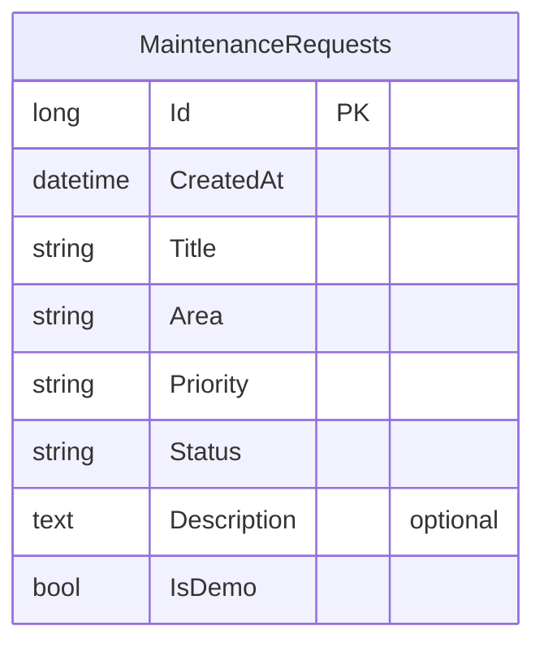

# Approval: Build every operation of the locked API contract in contracts/openapi.

Run 20261010-co-working-space-maintenance-e1b5 · risk **high** · feature · size L · cost so far $0.65

## Your request (word for word)
> # Co-working Space — Maintenance Requests
> 
> ## 1. Product Overview
> 
> A small web app for **Hive Works**, a single co-working space. People who work there report things that need fixing (a broken chair, a leaking tap, a dead light), and the front-desk manager moves each request from open to done.
> 
> This release is deliberately small: **2 screens**, one user, one kind of record. Sections 4 to 7 are the whole scope; nothing beyond them is wanted.
> 
> There is no existing application code. It is a web front end with a small API and a database behind it.
> 
> ---
> 
> ## 2. Product Goals
> 
> - Report a problem in under a minute.
> - See at a glance what is open, in progress and done.
> - Keep the status of a request honest: it can only move in the allowed order.
> 
> ---
> 
> ## 3. User
> 
> One already-signed-in demo user, **Sam Carter** (initials "SC"), who can do everything in this document. There is no sign-in screen and there are no roles.
> 
> ---
> 
> ## 4. Data
> 
> ### 4.1 Request
> 
> | Field | Rules |
> | --- | --- |
> | ID | Set by the system |
> | Title | Required, 3 to 80 characters |
> | Area | Required, one of `Kitchen`, `Meeting room`, `Open desk`, `Washroom`, `Reception` |
> | Priority | Required, one of `Low`, `Normal`, `Urgent` |
> | Description | Optional, up to 500 characters |
> | Status | One of `Open`, `In progress`, `Done` |
> | Created | Set by the system when the request is made |
> 
> There is no other record type.
> 
> ### 4.2 Seed Data
> 
> The app ships with exactly 8 requests:
> 
> - 4 `Open` (one of them `Urgent`)
> - 2 `In progress`
> - 2 `Done`
> 
> Between them they use every area at least once.
> 
> ### 4.3 Persistence
> 
> Requests are stored in the database and survive a reload and a restart.
> 
> ---
> 
> ## 5. Business Rules
> 
> 1. **Valid request** — A request needs a title of 3 to 80 characters, an area and a priority. A description, when given, is at most 500 characters. Anything else is rejected with a message naming the field.
> 2. **Starts open** — A new request always starts as `Open`.
> 3. **Status order** — The only allowed status changes are:
>    - `Open` → `In progress`
>    - `In progress` → `Done`
>    - `Done` → `Open` (reopen)
> 
>    Any other change is rejected.
> 4. **Fixed after creation** — Title, area, priority and description cannot be changed after the request is made. Requests cannot be deleted.
> 
> The rules are enforced by the API, not only by the screens.
> 
> ### 5.1 API operations
> 
> The API needs these four operations and no others:
> 
> 1. List requests, optionally only those with one given status. Newest first.
> 2. Create a request.
> 3. Get one request by ID.
> 4. Change the status of one request.
> 
> ---
> 
> ## 6. Screens
> 
> ### Screen 1 — Requests (home)
> 
> - Top bar: "Hive Works" wordmark and the user's initials.
> - Status filter with four choices: `All`, `Open`, `In progress`, `Done`. One is selected at a time; `All` is the default.
> - **New request** button.
> - List of requests, newest first. Each row shows: title, area, priority badge, status badge and created date (for example "8 Oct 2026").
> - Clicking a row opens Screen 2.
> 
> **New request dialog**
> 
> - Opened by the New request button.
> - Fields: Title, Area (select), Priority (select, default `Normal`), Description (multi-line).
> - Buttons: `Create` and `Cancel`.
> - A field that breaks rule 1 shows its message under the field, and the dialog stays open.
> - On success the dialog closes and the new request is at the top of the list.
> 
> **States**
> 
> - Loading: "Loading requests…"
> - Empty (no requests for the selected filter): "No requests here."
> - Error: "Could not load requests." with a `Retry` button.
> 
> ### Screen 2 — Request detail
> 
> - Back link to Screen 1.
> - Title, area, priority badge, status badge, created date and description (or "No description." when there is none).
> - One action button, depending on status:
> 
> | Status | Button |
> | --- | --- |
> | `Open` | `Start work` (moves to `In progress`) |
> | `In progress` | `Mark done` (moves to `Done`) |
> | `Done` | `Reopen` (moves to `Open`) |
> 
> - After the change, the status badge and the button show the new status.
> - If the change fails: "Could not update the request." The status shown stays as it was.
> - An ID that does not exist shows "Request not found." with a link back to Screen 1.
> 
> ---
> 
> ## 7. Design Requirements
> 
> Clean and plain; a tidy internal tool.
> 
> - One light theme. No dark mode.
> - One brand colour for primary buttons, a neutral background, near-black text.
> - Status badges: `Open` blue, `In progress` amber, `Done` green. Priority `Urgent` red; `Low` and `Normal` neutral. Every badge shows its text, so colour is never the only signal.
> - One sans-serif font.
> - Works at 375 px wide (rows stack as cards) and at 1280 px wide (rows as a table). No horizontal page scroll.
> - Every field has a label, every control can be reached by keyboard, and text meets WCAG AA contrast.
> - No animation is required.
> 
> ---
> 
> ## 8. Decisions Already Made
> 
> These are settled and need no question:
> 
> - No sign-in, no roles, no second user.
> - No editing or deleting a request.
> - No search, no sorting choices, no paging. The list shows every request for the selected filter.
> - No comments, attachments, assignees or due dates.
> - No notifications, email or live updates. The list is current when the page loads or the filter changes.
> - No optimistic updates and no undo: the screen changes after the API answers.
> - The created date is stored in UTC and shown as a date only, with no time and no timezone handling.
> - English only.
> - A double click on `Create` must not make two requests: the button is disabled while the request is being sent.
> 
> ---
> 
> ## 9. Testing Requirements
> 
> Automated tests for the business rules:
> 
> - A valid request is created and starts as `Open`.
> - A request with a missing or too-short title, a missing area or a too-long description is rejected.
> - Each of the three allowed status changes works.
> - A status change outside the allowed order is rejected.
> - The list filtered by a status returns only requests with that status, newest first.
> - An unknown ID is answered as not found.
> 
> Plus one end-to-end test: open the list → create a request → see it at the top → open it → Start work → Mark done → filter by `Done` and see it there.
> 
> ---
> 
> ## 10. Acceptance Criteria Examples
> 
> **Create**
> 
> Given the New request dialog is open,
> When the user enters the title "Kitchen tap is leaking", area `Kitchen`, priority `Urgent` and clicks `Create`,
> Then the dialog closes and the request is first in the list with status `Open`.
> 
> **Validation**
> 
> Given the New request dialog is open,
> When the user clicks `Create` with a title of 2 characters,
> Then the dialog stays open and the Title field shows "Title must be 3 to 80 characters."
> 
> **Status order**
> 
> Given a request with status `Open`,
> When a change straight to `Done` is sent to the API,
> Then it is rejected and the status stays `Open`.
> 
> **Filter**
> 
> Given the seed data,
> When the user selects the `In progress` filter,
> Then exactly 2 requests are listed.
> 
> **Not found**
> 
> Given no request has the ID in the address,
> When Screen 2 opens,
> Then it shows "Request not found."
> 
> ---
> 
> ## 11. Final Scope Summary
> 
> Two screens over one record type:
> 
> 1. **Requests** — a filtered list and a dialog to create a request.
> 2. **Request detail** — the request and one button that moves its status forward or reopens it.
> 
> Four API operations, four business rules, 8 seeded requests, one light theme.
> 
> This run builds the API side of the product above, in an existing .NET API project. Build every operation of the locked API contract in contracts/openapi.yaml, exactly as it is written there. Keep the data in the project's PostgreSQL database (the connection string named App, which the project already reads), and write its sample data in App.Api/SeedData.cs: a few believable rows for each table, taken from the contract's examples, so each list has something to show. The app runs that file only when the setting Seed:Demo is true, so no test may count on those rows. The web app is built in its own repo; do not build screens here.

## Your answers
- Q-1 How many demo requests and what status/area coverage should SeedData.Run provide, given the product document specifies exactly eight but the implementation request asks for only a few contract-example rows? → **Seed a few believable rows from the contract examples, without requiring eight rows or specified status and area counts.**
- Q-2 What should happen if SeedData.Run is invoked more than once while demo seeding is enabled? → **Do not insert duplicate demo rows on repeated runs.**
- Q-3 For create-request validation, should the API implement only the validation and error details defined by the locked OpenAPI contract, or also enforce the product document’s explicit field limits and messages wherever they differ or are absent from the contract? → **Use only the validation and errors defined by the locked OpenAPI contract.**
- Q-4 If PostgreSQL is unreachable, should the application fail during startup, or start successfully and fail only when an operation needs the database? → **Fail startup when PostgreSQL cannot be reached; do not fall back to another store.**
- Q-5 Should the existing GET / health endpoint remain alongside the four contract operations, or should it be removed so the API exposes only the operations in the contract? → **Keep the existing GET / health endpoint in addition to the four contract operations.**

Other assumptions: ASM-1 How should the requested screen-flow end-to-end test be handled in this API-only repository? → assumed: Implement API/business-rule tests here; leave the screen-flow end-to-end test to the separate web-app repository.

## Requirements
- **REQ-1** (ADDED) When a client calls GET /api/requests, the Maintenance Requests API shall return HTTP 200 with all matching requests ordered by createdAt descending (with no required relative order for equal timestamps), HTTP 400 with the contract ErrorResponse for malformed or unsupported status filters, and HTTP 500 with message "Could not load requests." for list failures.
  - AC-1.1 [api] Given The database contains requests with different createdAt timestamps, including at least two with equal timestamps.; when A client calls GET /api/requests without a status filter.; then The response status is 200 and the returned requests list contains all stored records in descending createdAt order, with no required relative order for equal timestamps.
  - AC-1.2 [api] Given The database contains requests in each supported status.; when A client calls GET /api/requests with one supported status filter.; then The response status is 200 and every record in the returned requests list has the requested status; the list is ordered newest first.
  - AC-1.3 [api] Given The request table contains rows and a client supplies a malformed or unsupported status value.; when The client calls GET /api/requests with that status filter.; then The response status is 400, the response message is "Status must be Open, In progress, or Done.", and response field errors.status contains "Unsupported status filter."
  - AC-1.4 [api] Given The database operation for loading the request list fails after startup.; when A client calls GET /api/requests.; then The response status is 500 and the response message is "Could not load requests."
- **REQ-2** (ADDED) When a client sends a valid POST /api/requests body, the Maintenance Requests API shall create and return HTTP 201 with a positive system-assigned id, UTC createdAt, trimmed title and description, and Open status, ignore caller-supplied id, createdAt, or status values, omit an absent or blank-after-trimming description, and return HTTP 500 with message "Could not create the request." if creation fails.
  - AC-2.1 [api] Given The database is available and contains no request matching the submitted data.; when A client posts a valid request with padded title and description and valid caller-supplied id, createdAt, and status values.; then The response status is 201; the returned record has a positive system-generated id, UTC createdAt, trimmed title and description, status field "Open", and only fields allowed by the MaintenanceRequest schema; caller-supplied system-controlled values are not used.
  - AC-2.2 [api] Given The database is available and the request body has a valid title, area, and priority.; when A client posts a valid request once without description and once with a description that is blank after trimming.; then Both response statuses are 201 and neither returned resource has a description field.
  - AC-2.3 [api] Given The database operation for creating a valid request fails after startup.; when A client posts the request.; then The response status is 500 and the response message is "Could not create the request."
- **REQ-3** (ADDED) If a POST /api/requests body is malformed or violates the CreateRequest schema, then the Maintenance Requests API shall return HTTP 400 with a contract ErrorResponse and no created row, using only contract-defined validation constraints and errors.
  - AC-3.1 [api] Given The request table has a known row count.; when A client posts a request with a two-character title or omits the title.; then The response status is 400, the response message is "Request validation failed.", response field errors.title contains "Title must be 3 to 80 characters.", and the request row count is unchanged.
  - AC-3.2 [api] Given The request table has a known row count.; when A client posts a request without area or with an area outside the contract enum.; then The response status is 400, the response message is "Request validation failed.", response field errors.area identifies the invalid or missing area (including "Area is required." when area is missing), and the request row count is unchanged.
  - AC-3.3 [api] Given The request table has a known row count.; when A client posts a request with a description longer than 500 characters.; then The response status is 400, response field errors.description contains "Description must be at most 500 characters.", and the request row count is unchanged.
  - AC-3.4 [api] Given The request table has a known row count.; when A client posts malformed JSON, a wrong field type, a missing or unsupported priority, or an undeclared extra property other than the declared optional id, createdAt, or status inputs.; then The response status is 400, the response follows the ErrorResponse schema with contract-defined field errors where applicable, and the request row count is unchanged.
- **REQ-4** (ADDED) When a client sends GET /api/requests/{id}, the Maintenance Requests API shall return HTTP 200 with the matching resource, HTTP 404 with message "Request not found." when no request has that id, and HTTP 500 with message "Could not load the request." when loading fails for a non-not-found reason.
  - AC-4.1 [api] Given A request with a known id exists.; when A client calls GET /api/requests/{id} using that id.; then The response status is 200 and the returned record matches the stored request fields defined by the MaintenanceRequest schema.
  - AC-4.2 [api] Given No request has the requested id.; when A client calls GET /api/requests/{id}.; then The response status is 404 and the response message is "Request not found."
  - AC-4.3 [api] Given The database operation for loading an existing request fails for a reason other than the request being absent.; when A client calls GET /api/requests/{id}.; then The response status is 500 and the response message is "Could not load the request."
- **REQ-5** (ADDED) When a client sends PATCH /api/requests/{id}/status, the Maintenance Requests API shall return HTTP 200 with the updated resource for only the transitions Open to In progress, In progress to Done, and Done to Open, HTTP 400 for an unsupported status or immutable or extra properties, HTTP 404 with message "Request not found." for an unknown id, HTTP 409 with message "This status transition is not allowed." for any other transition, and HTTP 500 with message "Could not update the request." when updating fails.
  - AC-5.1 [api] Given A request exists in each of the statuses Open, In progress, and Done.; when A client sends the respective allowed status changes Open to In progress, In progress to Done, and Done to Open.; then Each response status is 200, each returned record has the requested status, and its other stored fields remain unchanged.
  - AC-5.2 [api] Given A request has a current status and the requested status is not an allowed transition from it, including a request to retain its current status.; when A client requests that status change.; then The response status is 409, the response message is "This status transition is not allowed.", and the stored row's status remains unchanged.
  - AC-5.3 [api] Given A request exists and its stored fields are known.; when A client sends an unsupported or missing status, an immutable field, or an extra property in the status-change request body.; then The response status is 400 with the documented ErrorResponse message and field errors where applicable, and the stored row fields are unchanged.
  - AC-5.4 [api] Given No request has the requested id.; when A client sends PATCH /api/requests/{id}/status for that id.; then The response status is 404 and the response message is "Request not found."
  - AC-5.5 [api] Given The database operation for persisting a valid status change fails after startup.; when A client sends PATCH /api/requests/{id}/status.; then The response status is 500 and the response message is "Could not update the request."
- **REQ-6** (MODIFIED) The Maintenance Requests API shall persist request records in the PostgreSQL database selected by the configured connection string named App, provision the request schema for a new database and for an existing database lacking that schema—including one previously initialized by the existing EnsureCreated startup path without a migration-history table—and preserve unrelated existing tables and request records across service restarts.
  - AC-6.1 [api] Given PostgreSQL is available and the API is configured with ConnectionStrings:App pointing to the test PostgreSQL database.; when A client creates a request, the API is restarted with the same configuration, and the client retrieves that request by id.; then The create response status is 201; the response after restart has status 200 and returns the same record with the same id and field values; a row for the request is present in the database selected by App.
  - AC-6.2 [api] Given The configured PostgreSQL database was initialized through the previous EnsureCreated startup path, has no migration-history table, contains a pre-existing unrelated table and row, and has no maintenance-request table.; when The API starts, a client creates a valid request, the API is restarted with the same configuration, and the client retrieves that request by id.; then The create response status is 201; the response after restart has status 200 and returns the same record with the same id and field values; a row for the request is present in the database selected by App, and the pre-existing table and row remain present.
- **REQ-7** (MODIFIED) The SeedData.Run method shall add at least three maintenance-request rows drawn from the locked contract examples to the PostgreSQL request table, using system-assigned positive IDs and UTC creation timestamps rather than explicitly inserting the example IDs.
  - AC-7.1 [unit] Given The PostgreSQL request table is empty.; when A test calls the public SeedData.Run(AppDb) method directly.; then The request table contains at least three rows with title, area, priority, and status values matching the contract examples for Kitchen tap leaking, Projector won't power on, and Wobbly desk B-14; each row has a positive id and a UTC createdAt value.
- **REQ-8** (ADDED) ⚠ only one draft had this When SeedData.Run is invoked, the demo seeder shall leave exactly one row for each selected contract-example title after any number of invocations, without increasing the request row count on repeated invocations.
  - AC-8.1 [unit] Given The PostgreSQL request table is empty.; when A test calls the public SeedData.Run method twice.; then The request row count is at least three and exactly one row exists for each selected example title: "Kitchen tap leaking", "Projector won't power on", and "Wobbly desk B-14".
- **REQ-9** (MODIFIED) The Maintenance Requests API shall invoke SeedData.Run at startup if and only if Seed:Demo is true, add no demo rows when Seed:Demo is false or unset, and support API-operation tests that arrange any needed rows themselves rather than depend on demo rows.
  - AC-9.1 [api] Given The PostgreSQL request table is empty and Seed:Demo is false or unset.; when The API starts and a client calls GET /api/requests.; then The response status is 200 and the returned requests list count is 0.
- **REQ-10** (MODIFIED) If PostgreSQL cannot be reached during application startup, then the Maintenance Requests API shall fail startup without switching to another data store.
  - AC-10.1 [api] Given The configured PostgreSQL server cannot be reached during startup.; when The API process starts and a client attempts to call GET /.; then A startup error is reported, the process exits without serving an API response, and no response is served from an alternate store.
- **REQ-11** (MODIFIED) The Maintenance Requests API shall continue to return HTTP 200 with the health response "API is up" from GET /.
  - AC-11.1 [api] Given The API is running with PostgreSQL available.; when A client calls GET /.; then The response status is 200 and the returned response body is "API is up".
- **REQ-12** (ADDED) ⚠ only one draft had this The API delivery shall not render maintenance-request screens for the separate web application.
  - AC-12.1 [manual] Given The API delivery is running.; when A person opens the API origin in a browser.; then No maintenance-request screen is displayed.
- **REQ-13** (ADDED) ⚠ only one draft had this The API repository shall not implement web-app screens; the screen-flow end-to-end test belongs in the separate web-app repository.
  - AC-13.1 [manual] Given The API repository build is complete.; when A reviewer inspects the delivered application routes and repository artifacts.; then No screen or page for the web app is provided by this repository.

Checked by a person, not by a test: AC-12.1, AC-13.1 (each needs a person's sign-off before delivery)

Not changing: Product screen flows and the screen-flow end-to-end test in the separate web-app repository (d1 ASM-1; d2 ASM-1; d3 ASM-1).; I-5 web-app screen implementation; screen-flow end-to-end test (d2).; An exactly-eight seed set or required status/area counts are excluded (d3 Q-1).; Validation rules or error messages beyond those defined by the locked OpenAPI contract are excluded (d3 Q-3).

## Files the plan will touch (12)
- App.Api/AppDb.cs
- App.Api/EndpointRegistration.cs  ← not found by grounding; check it
- App.Api/Endpoints/ChangeRequestStatusEndpoint.cs  ← not found by grounding; check it
- App.Api/Endpoints/CreateRequestEndpoint.cs  ← not found by grounding; check it
- App.Api/Endpoints/GetRequestEndpoint.cs  ← not found by grounding; check it
- App.Api/Endpoints/ListRequestsEndpoint.cs  ← not found by grounding; check it
- App.Api/MaintenanceRequest.cs  ← not found by grounding; check it
- App.Api/MaintenanceRequestResource.cs  ← not found by grounding; check it
- App.Api/Migrations/20261010000000_CreateMaintenanceRequests.cs  ← not found by grounding; check it  ← protected file
- App.Api/Migrations/AppDbModelSnapshot.cs  ← not found by grounding; check it  ← protected file
- App.Api/Program.cs
- App.Api/SeedData.cs

## Will also affect (found by code search, not in the plan)
- contracts/openapi.yaml (undefined): REQ-7 (MODIFIED) points at it
- App.Tests/HealthTests.cs (undefined): REQ-9 (MODIFIED) points at it

## Plan
Options: OPT-1: Simplest: use an additive CREATE TABLE IF NOT EXISTS initializer and convention-discovered endpoint registrars. | OPT-2 (chosen): Use an EF Core migration with Database.Migrate and convention-discovered endpoint registrars.
Decision: Choose EF Core migrations and replace EnsureCreated with Migrate to provision the request table additively while preserving unrelated tables.
Use a convention-discovered endpoint registrar: TASK-1 wires discovery and the list route; each later API slice adds its own route file.
Expose only the locked API operations and existing health route; do not edit the contract or implement screens/authentication.
- TASK-1 Persist requests and wire the list operation → REQ-1, REQ-10, REQ-11, REQ-12, REQ-13; must pass AC-1.1, AC-1.2, AC-1.3, AC-1.4, AC-10.1, AC-11.1, AC-12.1, AC-13.1
- TASK-2 Create and validate maintenance requests → REQ-2, REQ-3; must pass AC-2.1, AC-2.2, AC-2.3, AC-3.1, AC-3.2, AC-3.3, AC-3.4
- TASK-3 Retrieve a request and verify persistence across restarts → REQ-4, REQ-6; must pass AC-4.1, AC-4.2, AC-4.3, AC-6.1, AC-6.2
- TASK-4 Change request status through allowed transitions → REQ-5; must pass AC-5.1, AC-5.2, AC-5.3, AC-5.4, AC-5.5
- TASK-5 Seed contract examples idempotently when demo seeding is enabled → REQ-7, REQ-8, REQ-9; must pass AC-7.1, AC-8.1, AC-9.1

## Data model (contracts/data-model.yaml; 1 table, locked with the tests once you approve)
- **MaintenanceRequests**: Id long [PK], CreatedAt datetime, Title string, Area string, Priority string, Status string, Description text?, IsDemo bool

## Critic findings (20)
- [medium] REQ-1 AC-1.3 and AC-1.4 require exact messages ("Status must be Open, In progress, or Done.", "Unsupported status filter.", "Could not load requests.") but REQ-1 cites no anchor in contracts/openapi.yaml, so nothing shows these strings come from the locked contract that Q-3 makes the only source.
- [medium] REQ-2 The 500 message "Could not create the request." and the rule that a description blank after trimming is left out of the response are stated with no contract anchor, although the cited CreateRequest schema only says values are trimmed before validation.
- [low] REQ-4 REQ-4 has no anchors at all, yet it fixes the 404 message "Request not found." and the 500 message "Could not load the request." as contract behaviour.
- [medium] REQ-3 AC-3.1 expects "Title must be 3 to 80 characters." when the title is missing, while AC-3.2 expects the "Area is required." pattern when area is missing, so missing required fields are handled inconsistently and the title case has no anchor.
- [low] REQ-3 No AC covers a title that is all whitespace or becomes shorter than 3 characters after trimming, even though the cited contract says trimming happens before validation.
- [medium] REQ-4 Neither REQ-4 nor REQ-5 says what happens when {id} is not an integer, is zero or is negative (400 vs 404), so the malformed-path-parameter error path is missing.
- [medium] REQ-5 The transition rule is read-then-write with no atomicity or concurrency requirement, so two concurrent PATCHes (for example Done→Open racing Open→In progress) can both pass the transition check against a stale status.
- [low] REQ-5 No precedence is defined when an unknown id comes with an invalid body (400 vs 404), or when an invalid body targets a status that would not be an allowed transition anyway (400 vs 409).
- [medium] REQ-1 The intent's riskTags include auth and pii, but no requirement covers authentication, authorization or 401/403 paths, and none states that the contract defines no security, so the permission paths are left unaddressed.
- [high] REQ-7 REQ-7 says SeedData.Run "shall add at least three" rows on every call, while REQ-8 says repeated calls must not increase the row count, so the two requirements contradict each other on any call after the first.
- [high] REQ-8 Keying "exactly one row for each selected contract-example title" on title means a real user request titled "Kitchen tap leaking" (or existing duplicates) would force the seeder to skip, merge or delete data, which conflicts with REQ-6's promise to keep existing request records.
- [medium] REQ-7 AC-7.1 and AC-8.1 only cover an empty table, so seeding into an existing database that already has request rows with Seed:Demo=true is left unspecified.
- [medium] REQ-8 REQ-8 cites ASM-2 as a source and the spec's assumptions list "d1 ASM-2", but the human only accepted ASM-1, so the "at least three" reading of "a few" and the idempotency basis rest on an assumption nobody accepted.
- [low] REQ-7 REQ-7 requires "UTC creation timestamps" but does not say whether seeded createdAt values keep the contract example times (2026-03-16..18) or use the current time, so the seeded order and data cannot be checked.
- [medium] REQ-9 REQ-9 claims seeding happens "if and only if" Seed:Demo is true, but its only AC tests the false/unset case; there is no AC for the true case, and "support API-operation tests that arrange rows themselves" cannot be observed at any public surface.
- [medium] REQ-6 Provisioning a schema on databases that EnsureCreated already initialized, with no migration-history table, effectively replaces the existing EnsureCreated startup path, which changes how the test factory and existing deployments initialize their databases without that blast radius being stated.
- [low] REQ-6 The ACs in REQ-6 assert "a row for the request is present in the database" and "the pre-existing table and row remain present", which can only be checked by inspecting the database directly, not through the API.
- [low] REQ-10 The cited lines 20-22 of Program.cs are indented inside an enclosing block that is not shown, so the claim that startup always touches PostgreSQL (and therefore fails when it is unreachable) is not fully anchored.
- [low] REQ-12 REQ-12 and REQ-13 duplicate each other and rely only on manual ACs ("a person opens the API origin", "a reviewer inspects"), so neither can be verified automatically at a public surface.
- [low] REQ-3 In AC-3.2, "errors.area identifies the invalid or missing area" gives no exact string for an out-of-enum area, and AC-3.4's "contract-defined field errors where applicable" is equally vague, so neither assertion can be checked precisely.

## Still open after 3 repairs
- [critic high] REQ-7 REQ-7 says SeedData.Run "shall add at least three" rows on every call, while REQ-8 says repeated calls must not increase the row count, so the two requirements contradict each other on any call after the first.
- [critic high] REQ-8 Keying "exactly one row for each selected contract-example title" on title means a real user request titled "Kitchen tap leaking" (or existing duplicates) would force the seeder to skip, merge or delete data, which conflicts with REQ-6's promise to keep existing request records.

Round trip: the spec restated back matches your request (nothing dropped, nothing added).

**This spec has 13 requirements, about 2 runs' worth of work for a feature; approve it as one run or reject with which part to cut.**

## Decide
  factory approve 20261010-co-working-space-maintenance-e1b5 <hash> --note "your risk note"
  factory reject  20261010-co-working-space-maintenance-e1b5 <hash> --reason "why"

Card hash: cb359fa5