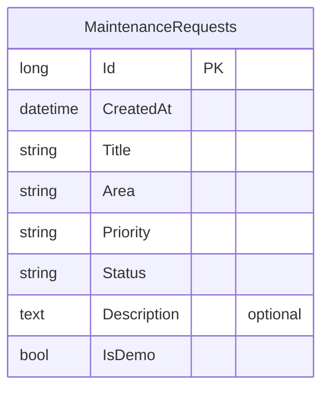

# factory: When a client calls GET /api/requests, the Maintenance Reque

## What was asked
> # Co-working Space — Maintenance Requests
> 
> ## 1. Product Overview
> 
> A small web app for **Hive Works**, a single co-working space. People who work there report things that need fixing (a broken chair, a leaking tap, a dead light), and the front-desk manager moves each request from open to done.
> 
> This release is deliberately small: **2 screens**, one user, one kind of record. Sections 4 to 7 are the whole scope; nothing beyond them is wanted.
> 
> There is no existing application code. It is a web front end with a small API and a database behind it.
> 
> ---
> 
> ## 2. Product Goals
> 
> - Report a problem in under a minute.
> - See at a glance what is open, in progress and done.
> - Keep the status of a request honest: it can only move in the allowed order.
> 
> ---
> 
> ## 3. User
> 
> One already-signed-in demo user, **Sam Carter** (initials "SC"), who can do everything in this document. There is no sign-in screen and there are no roles.
> 
> ---
> 
> ## 4. Data
> 
> ### 4.1 Request
> 
> | Field | Rules |
> | --- | --- |
> | ID | Set by the system |
> | Title | Required, 3 to 80 characters |
> | Area | Required, one of `Kitchen`, `Meeting room`, `Open desk`, `Washroom`, `Reception` |
> | Priority | Required, one of `Low`, `Normal`, `Urgent` |
> | Description | Optional, up to 500 characters |
> | Status | One of `Open`, `In progress`, `Done` |
> | Created | Set by the system when the request is made |
> 
> There is no other record type.
> 
> ### 4.2 Seed Data
> 
> The app ships with exactly 8 requests:
> 
> - 4 `Open` (one of them `Urgent`)
> - 2 `In progress`
> - 2 `Done`
> 
> Between them they use every area at least once.
> 
> ### 4.3 Persistence
> 
> Requests are stored in the database and survive a reload and a restart.
> 
> ---
> 
> ## 5. Business Rules
> 
> 1. **Valid request** — A request needs a title of 3 to 80 characters, an area and a priority. A description, when given, is at most 500 characters. Anything else is rejected with a message naming the field.
> 2. **Starts open** — A new request always starts as `Open`.
> 3. **Status order** — The only allowed status changes are:
>    - `Open` → `In progress`
>    - `In progress` → `Done`
>    - `Done` → `Open` (reopen)
> 
>    Any other change is rejected.
> 4. **Fixed after creation** — Title, area, priority and description cannot be changed after the request is made. Requests cannot be deleted.
> 
> The rules are enforced by the API, not only by the screens.
> 
> ### 5.1 API operations
> 
> The API needs these four operations and no others:
> 
> 1. List requests, optionally only those with one given status. Newest first.
> 2. Create a request.
> 3. Get one request by ID.
> 4. Change the status of one request.
> 
> ---
> 
> ## 6. Screens
> 
> ### Screen 1 — Requests (home)
> 
> - Top bar: "Hive Works" wordmark and the user's initials.
> - Status filter with four choices: `All`, `Open`, `In progress`, `Done`. One is selected at a time; `All` is the default.
> - **New request** button.
> - List of requests, newest first. Each row shows: title, area, priority badge, status badge and created date (for example "8 Oct 2026").
> - Clicking a row opens Screen 2.
> 
> **New request dialog**
> 
> - Opened by the New request button.
> - Fields: Title, Area (select), Priority (select, default `Normal`), Description (multi-line).
> - Buttons: `Create` and `Cancel`.
> - A field that breaks rule 1 shows its message under the field, and the dialog stays open.
> - On success the dialog closes and the new request is at the top of the list.
> 
> **States**
> 
> - Loading: "Loading requests…"
> - Empty (no requests for the selected filter): "No requests here."
> - Error: "Could not load requests." with a `Retry` button.
> 
> ### Screen 2 — Request detail
> 
> - Back link to Screen 1.
> - Title, area, priority badge, status badge, created date and description (or "No description." when there is none).
> - One action button, depending on status:
> 
> | Status | Button |
> | --- | --- |
> | `Open` | `Start work` (moves to `In progress`) |
> | `In progress` | `Mark done` (moves to `Done`) |
> | `Done` | `Reopen` (moves to `Open`) |
> 
> - After the change, the status badge and the button show the new status.
> - If the change fails: "Could not update the request." The status shown stays as it was.
> - An ID that does not exist shows "Request not found." with a link back to Screen 1.
> 
> ---
> 
> ## 7. Design Requirements
> 
> Clean and plain; a tidy internal tool.
> 
> - One light theme. No dark mode.
> - One brand colour for primary buttons, a neutral background, near-black text.
> - Status badges: `Open` blue, `In progress` amber, `Done` green. Priority `Urgent` red; `Low` and `Normal` neutral. Every badge shows its text, so colour is never the only signal.
> - One sans-serif font.
> - Works at 375 px wide (rows stack as cards) and at 1280 px wide (rows as a table). No horizontal page scroll.
> - Every field has a label, every control can be reached by keyboard, and text meets WCAG AA contrast.
> - No animation is required.
> 
> ---
> 
> ## 8. Decisions Already Made
> 
> These are settled and need no question:
> 
> - No sign-in, no roles, no second user.
> - No editing or deleting a request.
> - No search, no sorting choices, no paging. The list shows every request for the selected filter.
> - No comments, attachments, assignees or due dates.
> - No notifications, email or live updates. The list is current when the page loads or the filter changes.
> - No optimistic updates and no undo: the screen changes after the API answers.
> - The created date is stored in UTC and shown as a date only, with no time and no timezone handling.
> - English only.
> - A double click on `Create` must not make two requests: the button is disabled while the request is being sent.
> 
> ---
> 
> ## 9. Testing Requirements
> 
> Automated tests for the business rules:
> 
> - A valid request is created and starts as `Open`.
> - A request with a missing or too-short title, a missing area or a too-long description is rejected.
> - Each of the three allowed status changes works.
> - A status change outside the allowed order is rejected.
> - The list filtered by a status returns only requests with that status, newest first.
> - An unknown ID is answered as not found.
> 
> Plus one end-to-end test: open the list → create a request → see it at the top → open it → Start work → Mark done → filter by `Done` and see it there.
> 
> ---
> 
> ## 10. Acceptance Criteria Examples
> 
> **Create**
> 
> Given the New request dialog is open,
> When the user enters the title "Kitchen tap is leaking", area `Kitchen`, priority `Urgent` and clicks `Create`,
> Then the dialog closes and the request is first in the list with status `Open`.
> 
> **Validation**
> 
> Given the New request dialog is open,
> When the user clicks `Create` with a title of 2 characters,
> Then the dialog stays open and the Title field shows "Title must be 3 to 80 characters."
> 
> **Status order**
> 
> Given a request with status `Open`,
> When a change straight to `Done` is sent to the API,
> Then it is rejected and the status stays `Open`.
> 
> **Filter**
> 
> Given the seed data,
> When the user selects the `In progress` filter,
> Then exactly 2 requests are listed.
> 
> **Not found**
> 
> Given no request has the ID in the address,
> When Screen 2 opens,
> Then it shows "Request not found."
> 
> ---
> 
> ## 11. Final Scope Summary
> 
> Two screens over one record type:
> 
> 1. **Requests** — a filtered list and a dialog to create a request.
> 2. **Request detail** — the request and one button that moves its status forward or reopens it.
> 
> Four API operations, four business rules, 8 seeded requests, one light theme.
> 
> This run builds the API side of the product above, in an existing .NET API project. Build every operation of the locked API contract in contracts/openapi.yaml, exactly as it is written there. Keep the data in the project's PostgreSQL database (the connection string named App, which the project already reads), and write its sample data in App.Api/SeedData.cs: a few believable rows for each table, taken from the contract's examples, so each list has something to show. The app runs that file only when the setting Seed:Demo is true, so no test may count on those rows. The web app is built in its own repo; do not build screens here.

## Requirements → tests
- **REQ-1** When a client calls GET /api/requests, the Maintenance Requests API shall return HTTP 200 with all matching requests ordered by createdAt descending (with no required relative order for equal timestamps), HTTP 400 with the contract ErrorResponse for malformed or unsupported status filters, and HTTP 500 with message "Could not load requests." for list failures.
  - AC-1.1 (HTTP test + probe): `app.tests::App.Tests.RequestApiTests.AC_1_1_ListsAllRequestsNewestFirst`
  - AC-1.2 (HTTP test + probe): `app.tests::App.Tests.RequestApiTests.AC_1_2_FiltersByStatusNewestFirst(status: "In progress", expected: 2)`
  - AC-1.3 (HTTP test + probe): `app.tests::App.Tests.RequestApiTests.AC_1_3_RejectsUnsupportedStatusFilter(status: "Closed")`
  - AC-1.4 (HTTP test + probe): `app.tests::App.Tests.RequestApiTests.AC_1_4_Returns500WhenListCannotBeLoaded`
- **REQ-2** When a client sends a valid POST /api/requests body, the Maintenance Requests API shall create and return HTTP 201 with a positive system-assigned id, UTC createdAt, trimmed title and description, and Open status, ignore caller-supplied id, createdAt, or status values, omit an absent or blank-after-trimming description, and return HTTP 500 with message "Could not create the request." if creation fails.
  - AC-2.1 (HTTP test + probe): `app.tests::App.Tests.RequestApiTests.AC_2_1_CreatesRequestWithSystemAssignedFields`
  - AC-2.2 (HTTP test + probe): `app.tests::App.Tests.RequestApiTests.AC_2_2_OmitsDescriptionWhenAbsentOrBlank`
  - AC-2.3 (HTTP test + probe): `app.tests::App.Tests.RequestApiTests.AC_2_3_Returns500WhenRequestCannotBeCreated`
- **REQ-3** If a POST /api/requests body is malformed or violates the CreateRequest schema, then the Maintenance Requests API shall return HTTP 400 with a contract ErrorResponse and no created row, using only contract-defined validation constraints and errors.
  - AC-3.1 (HTTP test + probe): `app.tests::App.Tests.RequestApiTests.AC_3_1_RejectsInvalidOrMissingTitle(json: "{\"title\":\"ab\",\"area\":\"Kitchen\",\"priority\"···)`
  - AC-3.2 (HTTP test + probe): `app.tests::App.Tests.RequestApiTests.AC_3_2_RejectsMissingOrUnknownArea(json: "{\"title\":\"Kitchen tap leaking\",\"area\":\"Gara"···, missing: False)`
  - AC-3.3 (HTTP test + probe): `app.tests::App.Tests.RequestApiTests.AC_3_3_RejectsDescriptionLongerThan500Characters`
  - AC-3.4 (HTTP test + probe): `app.tests::App.Tests.RequestApiTests.AC_3_4_RejectsMalformedOrUnexpectedBodies(json: "{\"title\":\"Kitchen tap leaking\",\"area\":\"Kitc"···, errorField: null)`
- **REQ-4** When a client sends GET /api/requests/{id}, the Maintenance Requests API shall return HTTP 200 with the matching resource, HTTP 404 with message "Request not found." when no request has that id, and HTTP 500 with message "Could not load the request." when loading fails for a non-not-found reason.
  - AC-4.1 (HTTP test + probe): `app.tests::App.Tests.RequestApiTests.AC_4_1_ReturnsStoredRequestById`
  - AC-4.2 (HTTP test + probe): `app.tests::App.Tests.RequestApiTests.AC_4_2_Returns404WhenRequestMissing`
  - AC-4.3 (HTTP test + probe): `app.tests::App.Tests.RequestApiTests.AC_4_3_Returns500WhenRequestCannotBeLoaded`
- **REQ-5** When a client sends PATCH /api/requests/{id}/status, the Maintenance Requests API shall return HTTP 200 with the updated resource for only the transitions Open to In progress, In progress to Done, and Done to Open, HTTP 400 for an unsupported status or immutable or extra properties, HTTP 404 with message "Request not found." for an unknown id, HTTP 409 with message "This status transition is not allowed." for any other transition, and HTTP 500 with message "Could not update the request." when updating fails.
  - AC-5.1 (HTTP test + probe): `app.tests::App.Tests.RequestApiTests.AC_5_1_AppliesAllowedStatusTransitions(from: "Done", to: "Open")`
  - AC-5.2 (HTTP test + probe): `app.tests::App.Tests.RequestApiTests.AC_5_2_RejectsDisallowedStatusTransitions(from: "Open", to: "Done")`
  - AC-5.3 (HTTP test + probe): `app.tests::App.Tests.RequestApiTests.AC_5_3_RejectsInvalidStatusChangeBodies(json: "{}", statusError: True)`
  - AC-5.4 (HTTP test + probe): `app.tests::App.Tests.RequestApiTests.AC_5_4_Returns404WhenChangingMissingRequest`
  - AC-5.5 (HTTP test + probe): `app.tests::App.Tests.RequestApiTests.AC_5_5_Returns500WhenStatusCannotBePersisted`
- **REQ-6** The Maintenance Requests API shall persist request records in the PostgreSQL database selected by the configured connection string named App, provision the request schema for a new database and for an existing database lacking that schema—including one previously initialized by the existing EnsureCreated startup path without a migration-history table—and preserve unrelated existing tables and request records across service restarts.
  - AC-6.1 (HTTP test + probe): `app.tests::App.Tests.PersistenceAndSeedTests.AC_6_1_RequestSurvivesApiRestart`
  - AC-6.2 (HTTP test + probe): `app.tests::App.Tests.PersistenceAndSeedTests.AC_6_2_AddsRequestTableToDatabaseWithExistingTables`
- **REQ-7** The SeedData.Run method shall add at least three maintenance-request rows drawn from the locked contract examples to the PostgreSQL request table, using system-assigned positive IDs and UTC creation timestamps rather than explicitly inserting the example IDs.
  - AC-7.1 (unit test): `app.tests::App.Tests.PersistenceAndSeedTests.AC_7_1_SeedAddsContractExampleRows`
- **REQ-8** When SeedData.Run is invoked, the demo seeder shall leave exactly one row for each selected contract-example title after any number of invocations, without increasing the request row count on repeated invocations.
  - AC-8.1 (unit test): `app.tests::App.Tests.PersistenceAndSeedTests.AC_8_1_SeedRunTwiceAddsNoDuplicates`
- **REQ-9** The Maintenance Requests API shall invoke SeedData.Run at startup if and only if Seed:Demo is true, add no demo rows when Seed:Demo is false or unset, and support API-operation tests that arrange any needed rows themselves rather than depend on demo rows.
  - AC-9.1 (HTTP test + probe): `app.tests::App.Tests.RequestApiTests.AC_9_1_ListIsEmptyWhenNotSeeded`
- **REQ-10** If PostgreSQL cannot be reached during application startup, then the Maintenance Requests API shall fail startup without switching to another data store.
  - AC-10.1 (HTTP test + probe): `app.tests::App.Tests.PersistenceAndSeedTests.AC_10_1_StartupFailsWhenDatabaseUnreachable`
- **REQ-11** The Maintenance Requests API shall continue to return HTTP 200 with the health response "API is up" from GET /.
  - AC-11.1 (HTTP test + probe): `app.tests::App.Tests.RequestApiTests.AC_11_1_RootReportsApiIsUp`
- **REQ-12** The API delivery shall not render maintenance-request screens for the separate web application.
  - AC-12.1: checked by hand and signed off by Hamza (via web) (no automated test)
- **REQ-13** The API repository shall not implement web-app screens; the screen-flow end-to-end test belongs in the separate web-app repository.
  - AC-13.1: checked by hand and signed off by Hamza (via web) (no automated test)

## Tasks
- TASK-1 Persist requests and wire the list operation (REQ-1, REQ-10, REQ-11, REQ-12, REQ-13)
- TASK-2 Create and validate maintenance requests (REQ-2, REQ-3)
- TASK-3 Retrieve a request and verify persistence across restarts (REQ-4, REQ-6)
- TASK-4 Change request status through allowed transitions (REQ-5)
- TASK-5 Seed contract examples idempotently when demo seeding is enabled (REQ-7, REQ-8, REQ-9)

## Data model
1 table, approved with the plan and kept in `contracts/data-model.yaml`.

## Checks the factory ran itself
- 53 tests in a sealed container; 53 passed; no new failures vs the base branch
- Acceptance tests were written first, failed on the old code twice, then locked
- ⚠ Single model family: tests written by claude-sonnet-5-5, code by claude-sonnet-5-5 (both anthropic). A second-vendor coding runner isn't built yet.
- ⚠ Waived by mhamza: review.tests-prove-criteria (why this is fine)
- Review: 2 non-blocking findings
  - R-1 [medium] The build-generated OpenAPI document will include the `/api` route-group prefix in each path, while the locked contract defines `/api` as the server URL and paths such as `/requests`; consumers of the generated document will therefore see a different base/path layout than the contract.
  - R-2 [medium] The generated OpenAPI CreateRequest schema is derived from this DTO, but it supplies no title/description length constraints or `additionalProperties: false`, and its `status` property is `JsonElement?` rather than the contract's RequestStatus schema. The handler validates these rules at runtime, but the build-generated contract document does not describe them accurately.
- Security review (OWASP Top 10): nothing found

Cost: $9.19 · Run: `20261010-co-working-space-maintenance-e1b5` · Evidence manifest: `afc473b0b0e632c739c2453258b4bf8cacc5501883e1488f87c4d30b3135a58e`